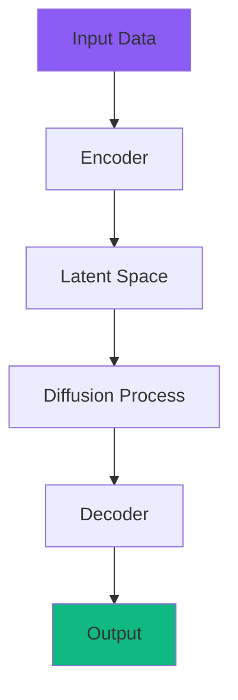

# Feature: arXiv → Blog Post Pipeline

Turn the top AI papers into publication-ready 2000-word blog posts on Notion, with workflow diagrams, fact-checking, and multi-agent quality optimization.

## Problem

You read 5 papers a day. Writing about them takes 2-3 hours per post. By the time you write, the news is old. You need a pipeline that drafts blog-quality content from research papers in minutes, not hours — while maintaining accuracy that you can trust.

## Solution: 5-Agent Blog Pipeline

```
Paper Selected
     │
     ▼
┌─────────────────────────────────────────────────────────┐
│  AGENT 1: Deep Reader                                   │
│  Reads the FULL paper (abstract + all sections)         │
│  Extracts: problem, method, results, limitations        │
│  Outputs: structured research notes (1000 words)        │
└───────────────────────┬─────────────────────────────────┘
                        ▼
┌─────────────────────────────────────────────────────────┐
│  AGENT 2: Blog Writer (GRPO — 3 candidates)            │
│  Transforms research notes into engaging blog post      │
│  2000 words, 6 sections, analogies for non-experts      │
│  GRPO: generates 3 drafts, reviewer picks best          │
└───────────────────────┬─────────────────────────────────┘
                        ▼
┌─────────────────────────────────────────────────────────┐
│  AGENT 3: Fact Checker                                  │
│  Cross-references claims against the original abstract  │
│  Flags: unsupported claims, hallucinated numbers,       │
│  missing caveats, misrepresented results                │
│  Returns: list of corrections needed                    │
└───────────────────────┬─────────────────────────────────┘
                        ▼
┌─────────────────────────────────────────────────────────┐
│  AGENT 4: Diagram Generator                             │
│  Creates Mermaid.js workflow diagrams from the method   │
│  Generates: architecture diagram, data flow, comparison │
│  Converts to PNG via mermaid-cli or API                 │
└───────────────────────┬─────────────────────────────────┘
                        ▼
┌─────────────────────────────────────────────────────────┐
│  AGENT 5: Editor + SEO (DSPy/GEPA optimized prompt)    │
│  Final polish: tone, flow, title, meta description      │
│  Adds: key takeaways box, further reading links         │
│  SEO: keyword density, readability score                │
└───────────────────────┬─────────────────────────────────┘
                        ▼
┌─────────────────────────────────────────────────────────┐
│  PUBLISH TO NOTION                                      │
│  Creates page with: title, cover image placeholder,     │
│  blog content, embedded diagrams, metadata              │
│  Sends Telegram: "Blog draft ready — approve to publish"│
└─────────────────────────────────────────────────────────┘
```

## Blog Post Structure (2000 words)

Every blog post follows this template:

```
# [Catchy Title — Not the Paper Title]
## Subtitle: What this means for AI practitioners

### TL;DR (50 words)
One paragraph explaining what the paper does and why you should care.

### The Problem (200 words)
What gap or challenge does this paper address?
Why hasn't this been solved before?
Real-world analogy to make it relatable.

### The Approach (500 words)
How does the method work? Step by step.
[DIAGRAM: Architecture / Workflow]
Key insight that makes this different from prior work.
Code-like pseudocode if applicable.

### Key Results (300 words)
Benchmarks, numbers, comparisons.
[TABLE: Performance comparison with baselines]
What surprised the researchers.

### Why This Matters (300 words)
Impact on the broader AI field.
Which industries or applications benefit.
How this connects to current trends (agents, LLMs, etc.)

### Practical Takeaways (400 words)
How YOU can use this today.
Implementation hints.
Links to code/repos if available.
Limitations and caveats.

### Further Reading (100 words)
Related papers.
Author's other work.
Relevant blog posts / tutorials.

---
Metadata: arXiv ID, authors, categories, date, PDF link
Word count: ~2000
Reading time: ~8 minutes
```

## Quality Assurance: GRPO + Fact Checking

### GRPO for Blog Writing

```
Step 1: Generate 3 blog drafts at temperatures [0.5, 0.7, 0.9]
Step 2: Score each on:
   - Accuracy (does it match the paper's claims?) — weight 3x
   - Readability (Flesch score, paragraph length) — weight 2x
   - Engagement (hook strength, analogy quality) — weight 2x
   - Completeness (all 6 sections present, 2000 words) — weight 1x
Step 3: Pick the best, store WHY it won as experience
Step 4: Future drafts start from the learned patterns
```

### Fact Checker Agent

The fact checker NEVER sees the blog draft first. It independently:
1. Reads the paper abstract
2. Extracts factual claims (numbers, comparisons, conclusions)
3. Then reads the blog draft
4. Flags any claim in the blog that:
   - Isn't supported by the abstract
   - Exaggerates or understates results
   - Missing important caveats (e.g., "only tested on English text")
   - Hallucinated numbers or benchmark scores

If flags > 3, the blog goes back to the Writer agent for revision.

### DSPy/GEPA Prompt Optimization

After 10+ blog posts:
- GEPA optimizes the Writer prompt based on which drafts you approved vs edited
- Training data: (paper abstract, approved blog post) pairs
- Metric: % of text you kept unchanged after review
- Over time, the writer learns YOUR tone, depth preference, and style

## Diagram Generation

### Mermaid.js Workflow Diagrams

Every blog post gets 1-2 diagrams generated from the paper's method:



### Options for Rendering

| Method | Pro | Con |
|--------|-----|-----|
| **Mermaid.js in Notion** | Notion supports code blocks | Not rendered as image |
| **mermaid.ink API** | Free, returns PNG URL | External dependency |
| **Local mermaid-cli** | Full control, no API | Requires npm install |
| **LLM → SVG description** | No deps | Less precise |

**Recommendation**: Use mermaid.ink API — free, no install needed:
```
https://mermaid.ink/img/{base64_encoded_mermaid_code}
```
Embed the image URL directly in Notion.

## Notion Blog Page Structure

Each blog post gets a dedicated Notion page:

```
Page Title: "DreamerAD: How Latent World Models Are Revolutionizing RL for Self-Driving"
Icon: 📝
Properties:
  - Status: Draft / Approved / Published
  - Paper: arXiv link
  - Score: 9/10
  - Category: RL, Efficiency
  - Word Count: 2000
  - Created: 2026-03-26

Content:
  [Cover image placeholder]
  [TL;DR callout block]
  [Full blog post with sections]
  [Embedded workflow diagram]
  [Results comparison table]
  [Further reading links]
  [Metadata footer]
```

## Telegram Approval Flow

```
Bot (Research): 📝 BLOG DRAFT READY

  "DreamerAD: How Latent World Models Are Revolutionizing RL"

  📊 Quality: 8.5/10 (GRPO best of 3)
  ✅ Fact check: 0 flags
  📐 Diagrams: 2 generated
  📏 Words: 2,034

  📎 Review on Notion: https://notion.so/...

  Reply:
  • "approve" — mark as ready to publish
  • "edit" — I'll review and edit on Notion
  • "regenerate" — try again with different angle
  • "skip" — don't blog this paper
```

## Extra Features I'm Adding

### 1. Paper Comparison Posts
When 2+ papers in the same week address similar topics:
```
"DreamerAD vs World Models 2.0: Two Approaches to Efficient RL"
```
Side-by-side comparison blog — readers love these.

### 2. Weekly Roundup Post
Every Sunday, auto-generate a "This Week in AI" post summarizing all 5 daily digests:
```
"This Week in AI: 25 Papers, 5 Themes, 1 Clear Trend"
```
Higher-level patterns + connections between papers.

### 3. Thread-Ready Format
Besides the full blog, generate a Twitter/X thread version (10 tweets):
```
🧵 1/10: DreamerAD just dropped and it's a game-changer for RL...
```
Stored alongside the blog for easy cross-posting.

### 4. Trending Topic Detection
Track which topics appear most across papers over weeks:
```
Week 1: agents (12 papers), reasoning (8), efficiency (6)
Week 2: agents (15), reasoning (11), safety (9) ← safety trending up
```
Suggest blog topics based on rising trends.

### 5. Citation Graph
For each blogged paper, find:
- Papers it references (backward)
- Papers that cite it (forward, via Semantic Scholar API)
Build a "research lineage" section showing how this paper fits in the field.

### 6. Code Repository Finder
Search GitHub for implementations of the paper:
- Search by paper title + "implementation"
- Check Papers With Code API
- Include repo links + star count in the blog

## Implementation Plan

### Phase 1: Core blog generation pipeline
- Deep Reader + Blog Writer (GRPO) + Notion page creation
- "blog 1" command to generate blog for paper #1

### Phase 2: Fact Checker + Diagram Generator
- Independent fact checking agent
- Mermaid.js diagram generation + rendering

### Phase 3: Approval flow + Notion integration
- Telegram approval (approve/edit/regenerate/skip)
- Notion page with proper structure + metadata

### Phase 4: Weekly roundup + thread format
- Sunday auto-roundup
- Twitter thread format alongside blog

### Phase 5: Trending detection + citation graph
- Topic tracking over weeks
- Semantic Scholar citation lookups

## Files to Create

| File | Purpose |
|------|---------|
| `jobpulse/blog_generator.py` | 5-agent pipeline: reader → writer → checker → diagrams → editor |
| `jobpulse/diagram_generator.py` | Mermaid.js code generation + PNG rendering |
| `jobpulse/fact_checker.py` | Cross-reference blog claims against paper |

## Files to Modify

| File | Change |
|------|--------|
| `jobpulse/arxiv_agent.py` | Add "blog N" command routing |
| `jobpulse/command_router.py` | Add BLOG_PAPER intent |
| `jobpulse/dispatcher.py` | Add blog handler |
| `jobpulse/notion_papers_agent.py` | Blog page creation in Notion |

## Cost

| Component | Per Blog | Daily (1 blog) | Monthly |
|-----------|----------|-----------------|---------|
| Deep Reader (abstract analysis) | $0.003 | $0.003 | $0.09 |
| Blog Writer (GRPO × 3) | $0.015 | $0.015 | $0.45 |
| Fact Checker | $0.003 | $0.003 | $0.09 |
| Diagram Generator | $0.002 | $0.002 | $0.06 |
| Editor + SEO | $0.003 | $0.003 | $0.09 |
| **Total per blog** | **$0.026** | | |
| **5 blogs/week** | | | **$0.52** |

## Success Metrics

- Blog approval rate (target: 80%+ approved without edits)
- Fact check flag rate (target: <1 flag per blog)
- Word count accuracy (target: 1900-2100 words)
- Time from paper → draft (target: <3 minutes)
- GRPO improvement over time (draft quality score trend)
- Reader engagement (if published: views, shares)
